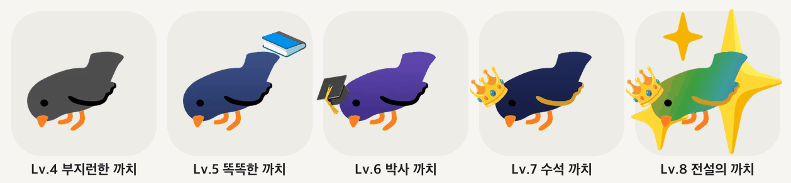

# 까치녹음기

맥(Apple Silicon)에서 **인터넷 없이** 녹음 → 전사 → 화자 구분까지 해주는 개인용 앱.
한국어 / 영어 / 한·영 혼합 강의를 지원한다.

## 까치 레벨
받아쓴 강의 시간이 쌓이면 까치가 자라요 (Lv.4~8).



## 구성
| 역할 | 사용 기술 |
|---|---|
| 전사 | Qwen3-ASR 1.7B (MLX, 8bit) via `mlx-audio` |
| 단어 타임스탬프 | Qwen3-ForcedAligner 0.6B (+ `soynlp` 한국어 토크나이저) |
| 화자 구분 | Nemotron 3 Diarization (MLX, 최대 8명) |
| 언어 감지 (한·영 혼합) | SpeechBrain ECAPA VoxLingua107 (MLX) |
| 오디오 변환 | `imageio-ffmpeg` (Homebrew 불필요) |
| 서버 | FastAPI + uvicorn |
| 저장 | SQLite (`~/Library/Application Support/KkachiNogeumgi/`) |

## 설치 (사용하는 맥에서)

자세한 현장 설치·확인 목록·문제 해결: [docs/INSTALL-GUIDE.md](docs/INSTALL-GUIDE.md)

```bash
git clone https://github.com/kimdoyoung1110/kkachi-nogeumgi.git ~/까치녹음기
```
Finder 에서 `~/까치녹음기/설치.command` 를 두 번 누르면 끝 (uv · 라이브러리 · 모델 약 4GB · 시험 받아쓰기 · `까치녹음기.app` 생성).
다시 실행하면 최신 버전으로 업데이트된다. 평소 업데이트는 앱 안 ⚙ › 업데이트 확인.

- 앱(Swift 실행기)이 서버를 띄우고 브라우저로 `http://127.0.0.1:8765` 를 연다. 실행 중엔 인터넷에 접속하지 않음(`HF_HUB_OFFLINE=1`).
- 데이터: `~/Library/Application Support/KkachiNogeumgi/` (녹음, DB, 로그)
- 실행기 수정 후: `scripts/build_launcher.sh` 로 `assets/kkachi-launcher` 를 다시 만들어 커밋

## 개발 실행
```bash
uv sync
uv run uvicorn app.main:app --port 8765 --reload   # 서버 (http://localhost:8765)
uv run python -m app.cli 녹음.m4a                    # 파일 하나 바로 처리해서 출력
uv run pytest                                        # 테스트
```
데이터 위치를 바꾸려면 `KKACHI_DATA_DIR=/경로` 환경변수.

## 폴더
```
app/       서버 코드
web/       화면 (HTML/JS)
scripts/   설치·실행·업데이트 스크립트
tests/     테스트 + 테스트용 음성(tests/audio)
docs/      계획·벤치마크 기록
```

## 그림 출처
- 레벨·연출의 움직이는 이모지: Google [Noto Emoji Animation](https://googlefonts.github.io/noto-emoji-animation/) (CC BY 4.0) — `web/emoji/LICENSE.md`
- 앱 아이콘: Apple Color Emoji 를 이용해 직접 그림 (`assets/make-icon.swift`)
